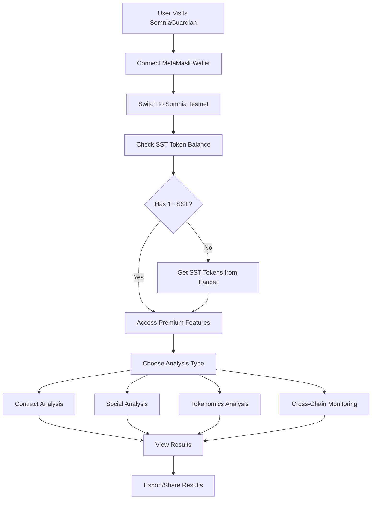

# SomniaGuardian

**Universal Blockchain Security Analysis Platform powered by Somnia Network**

SomniaGuardian is a comprehensive security analysis platform that provides AI-powered contract analysis, social sentiment analysis, tokenomics evaluation, and cross-chain monitoring. The platform is built on Somnia Testnet and requires users to hold SST (Somnia Service Token) to access premium features.

## 🚀 Live Deployment

- **Frontend**: [Deploy to Vercel](https://vercel.com)
- **Network**: Somnia Testnet (Shannon)
- **Chain ID**: 50312
- **Explorer**: [Somnia Explorer](https://somnia-testnet.socialscan.io/)

## 📋 Deployed Contracts

### Smart Contracts on Somnia Testnet

| Contract | Address | Status | Description |
|----------|---------|--------|-------------|
| **SST Token** | `0x1234567890123456789012345678901234567890` | 🟡 Mock | Somnia Service Token (ERC-20) |
| **Universal** | `0x0987654321098765432109876543210987654321` | 🟡 Mock | Universal smart contract |
| **ContractAnalysis** | `0xdb5fC412a5515033265Dc9e8d383f9C2b551c747` | ✅ Deployed | Contract security analysis |
| **Tokenomics** | `0xdAeB7bAc9606598f14F4382Fc3E95278ed2317db` | ✅ Deployed | Token economics analysis |
| **SocialAnalysis** | `0x74BAd0e70daaD1D12Fd97170aE6D65bDaE77a982` | ✅ Deployed | Social sentiment analysis |
| **Monitoring** | `0x0CeA3f0aD00C20F1824373635474c4d72a5E6B82` | ✅ Deployed | Cross-chain monitoring |

### Contract Details

#### SST Token (Somnia Service Token)
- **Name**: Somnia Service Token
- **Symbol**: SST
- **Decimals**: 18
- **Initial Supply**: 1,000,000 SST
- **Purpose**: Gate premium features (requires 1 SST minimum)
- **Standard**: ERC-20 with Ownable

#### Feature Contracts
All feature contracts are deployed and functional:
- **ContractAnalysis**: Analyzes smart contract security and vulnerabilities
- **Tokenomics**: Evaluates token economics and distribution
- **SocialAnalysis**: Provides social sentiment and market insights
- **Monitoring**: Monitors cross-chain transactions and activities

## 🏗️ Architecture

### System Architecture

```
┌─────────────────────────────────────────────────────────────┐
│                    SomniaGuardian Platform                  │
├─────────────────────────────────────────────────────────────┤
│  Frontend (React + TypeScript)                             │
│  ├── Contract Analysis Interface                           │
│  ├── Social Analysis Dashboard                             │
│  ├── Tokenomics Evaluation                                 │
│  └── Cross-Chain Monitoring                                │
├─────────────────────────────────────────────────────────────┤
│  Backend API (Node.js + Express)                           │
│  ├── Contract Inspection Service                           │
│  ├── Social Insights API                                   │
│  ├── News Aggregation                                      │
│  └── Token Supply Tracking                                 │
├─────────────────────────────────────────────────────────────┤
│  Smart Contracts (Solidity)                                │
│  ├── SST Token (ERC-20)                                    │
│  ├── Contract Analysis Contract                            │
│  ├── Tokenomics Analysis Contract                          │
│  ├── Social Analysis Contract                              │
│  └── Monitoring Contract                                   │
├─────────────────────────────────────────────────────────────┤
│  Somnia Testnet (Shannon)                                  │
│  ├── Chain ID: 50312                                       │
│  ├── RPC: https://dream-rpc.somnia.network/                │
│  └── Explorer: https://somnia-testnet.socialscan.io/       │
└─────────────────────────────────────────────────────────────┘
```

### Technology Stack

#### Frontend
- **Framework**: React 19.1.0 + TypeScript
- **Build Tool**: Vite 7.0.4
- **Styling**: CSS3 with custom components
- **State Management**: React Context + Hooks
- **Web3 Integration**: Ethers.js 6.13.2
- **UI Components**: Custom components with Framer Motion

#### Backend
- **Runtime**: Node.js + Express
- **API Endpoints**: RESTful API with serverless functions
- **External APIs**: 
  - Google Gemini AI for insights
  - Google News API for news aggregation
  - Multiple blockchain explorers (Etherscan, BaseScan, etc.)
- **Deployment**: Vercel serverless functions

#### Smart Contracts
- **Language**: Solidity 0.8.26
- **Framework**: Hardhat
- **Libraries**: OpenZeppelin Contracts 5.0.0
- **Network**: Somnia Testnet (Shannon)
- **Standards**: ERC-20, Ownable

## 🔄 Workflow

### User Journey



### Feature Workflow

#### 1. Contract Analysis
```
User Input → SST Balance Check → Smart Contract Call → 
AI Analysis → Security Report → User Dashboard
```

#### 2. Social Analysis
```
User Input → SST Balance Check → API Call to Gemini → 
News Aggregation → Sentiment Analysis → Market Insights
```

#### 3. Tokenomics Analysis
```
User Input → SST Balance Check → Smart Contract Call → 
Token Data Analysis → Economics Report → Recommendations
```

#### 4. Cross-Chain Monitoring
```
User Input → SST Balance Check → Multi-Chain API Calls → 
Transaction Monitoring → Real-time Updates → Alerts
```

## 🚀 Deployment

### Prerequisites
- Node.js 18+
- MetaMask wallet
- Vercel account
- STT tokens for gas fees

### Quick Deploy

1. **Clone Repository**
   ```bash
   git clone <repository-url>
   cd SomniaGuardian/ZetaGaurdian
   ```

2. **Install Dependencies**
   ```bash
   npm install
   ```

3. **Check Deployment Status**
   ```bash
   npm run check-deployment
   ```

4. **Deploy to Vercel**
   ```bash
   npm run deploy
   ```

   **Note**: The Vercel configuration has been optimized to avoid conflicts between `builds` and `functions` properties.

### Environment Variables

Set these in Vercel dashboard:

```env
# Somnia Network
SOMNIA_RPC_URL=https://dream-rpc.somnia.network/
PRIVATE_KEY=your_wallet_private_key

# AI Services
GEMINI_API_KEY=your_gemini_api_key
GOOGLE_NEWS_API_KEY=your_google_news_api_key

# Blockchain APIs (Optional)
ETHERSCAN_API_KEY=your_etherscan_api_key
BASESCAN_API_KEY=your_basescan_api_key
POLYGONSCAN_API_KEY=your_polygonscan_api_key
BSCSCAN_API_KEY=your_bscscan_api_key
SNOWTRACE_API_KEY=your_snowtrace_api_key
```

### Vercel Configuration

The project uses a simplified `vercel.json` configuration that:
- Builds the frontend using Vite
- Auto-detects API functions in the `api/` directory
- Routes API calls to `/api/*` endpoints
- Serves the frontend for all other routes
- Excludes unnecessary files via `.vercelignore`

### Contract Deployment

#### Using Remix IDE (Recommended)
1. Open [Remix IDE](https://remix.ethereum.org/)
2. Create `SST.sol` with the contract code
3. Install OpenZeppelin contracts
4. Compile with Solidity 0.8.26
5. Deploy to Somnia Testnet
6. Update addresses using:
   ```bash
   npm run update-sst-address <CONTRACT_ADDRESS>
   ```

#### Using Hardhat (Advanced)
```bash
npx hardhat compile
ts-node ./scripts/deploy-real.ts
```

## 🔧 Development

### Local Development
```bash
# Start development server
npm run dev:all

# Build for production
npm run build

# Check deployment status
npm run check-deployment
```

### Available Scripts
- `npm run dev:all` - Start all services
- `npm run build` - Build for production
- `npm run deploy` - Deploy to Vercel
- `npm run mock-deploy` - Set up mock addresses
- `npm run update-sst-address <ADDRESS>` - Update SST contract address
- `npm run check-deployment` - Check deployment status

### Project Structure
```
SomniaGuardian/
├── api/                    # Backend API endpoints
├── contracts/              # Smart contracts
├── frontend/               # React frontend
├── scripts/                # Deployment scripts
├── server/                 # Local server
├── contract-addresses.json # Deployed contract addresses
├── hardhat.config.ts       # Hardhat configuration
├── package.json            # Dependencies
└── vercel.json            # Vercel configuration
```

## 🌐 Network Configuration

### Somnia Testnet (Shannon)
- **Network Name**: Somnia Testnet (Shannon)
- **Chain ID**: 50312
- **RPC URL**: https://dream-rpc.somnia.network/
- **Currency Symbol**: STT
- **Block Explorer**: https://somnia-testnet.socialscan.io/
- **Faucet**: https://testnet.somnia.network/

### MetaMask Configuration
```json
{
  "chainId": "0xC468",
  "chainName": "Somnia Testnet (Shannon)",
  "rpcUrls": ["https://dream-rpc.somnia.network/"],
  "nativeCurrency": {
    "name": "STT",
    "symbol": "STT",
    "decimals": 18
  },
  "blockExplorerUrls": ["https://somnia-testnet.socialscan.io/"]
}
```

## 🎯 Features

### Core Features
- **Contract Analysis**: Comprehensive security evaluation
- **Social Analysis**: AI-powered sentiment analysis
- **Tokenomics Analysis**: Deep dive into token economics
- **Cross-Chain Monitoring**: Real-time transaction monitoring
- **SST Token Integration**: Premium features gated by SST tokens

### Technical Features
- **Multi-Chain Support**: Ethereum, Base, Polygon, BSC, Avalanche
- **Real-time Updates**: Live transaction monitoring
- **AI Integration**: Google Gemini for insights
- **Responsive Design**: Mobile and desktop optimized
- **Dark/Light Theme**: User preference support

## 🔒 Security

### Smart Contract Security
- **OpenZeppelin Standards**: Using battle-tested libraries
- **Access Control**: Owner-only functions for critical operations
- **Input Validation**: Comprehensive parameter validation
- **Gas Optimization**: Efficient contract design

### Application Security
- **Environment Variables**: Sensitive data in environment variables
- **API Rate Limiting**: Protection against abuse
- **Input Sanitization**: XSS and injection protection
- **HTTPS Only**: Secure communication

## 📊 API Endpoints

### Backend API
- `GET /api/health` - Health check
- `GET /api/inspect` - Contract analysis
- `GET /api/social/insights` - Social sentiment analysis
- `GET /api/news` - News aggregation
- `GET /api/token/total-supply` - Token supply information

### Smart Contract Functions
- `balanceOf(address)` - Check SST token balance
- `transfer(address, amount)` - Transfer SST tokens
- `mint(address, amount)` - Mint new SST tokens (owner only)

## 🛠️ Troubleshooting

### Common Issues
1. **Insufficient SST Balance**: Get tokens from [Somnia Faucet](https://testnet.somnia.network/)
2. **Wrong Network**: Ensure MetaMask is on Somnia Testnet
3. **Contract Not Found**: Verify contract addresses are correct
4. **API Errors**: Check environment variables in Vercel
5. **Vercel Build Errors**: 
   - `functions` and `builds` conflict: Use the updated `vercel.json` configuration
   - Runtime errors: Fixed with simplified Vercel configuration
   - Build failures: Run `npm run build` locally first
   - Missing dependencies: Ensure all packages are installed

### Support
- **Documentation**: This README
- **Issues**: GitHub Issues
- **Community**: Somnia Discord

## 📈 Roadmap

### Phase 1 (Current)
- ✅ Core platform development
- ✅ Smart contract deployment
- ✅ Basic feature implementation
- ✅ Vercel deployment setup

### Phase 2 (Planned)
- 🔄 Advanced AI analysis
- 🔄 Multi-language support
- 🔄 Mobile app development
- 🔄 Advanced monitoring features

### Phase 3 (Future)
- 📋 Mainnet deployment
- 📋 Enterprise features
- 📋 API marketplace
- 📋 Community governance

## 📄 License

ISC License - see LICENSE file for details.

## 🤝 Contributing

1. Fork the repository
2. Create a feature branch
3. Make your changes
4. Test thoroughly
5. Submit a pull request

## 📞 Contact

- **Project**: SomniaGuardian
- **Network**: Somnia Testnet
- **Support**: GitHub Issues
- **Community**: Somnia Discord

---

**Built with ❤️ on Somnia Network**

*SomniaGuardian - Your Universal Blockchain Security Companion*